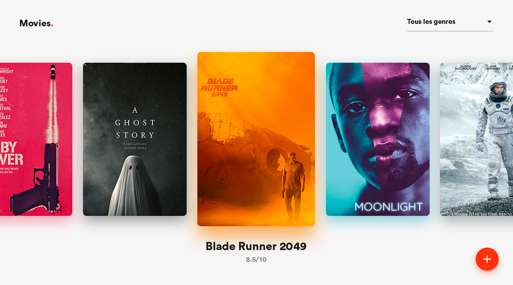
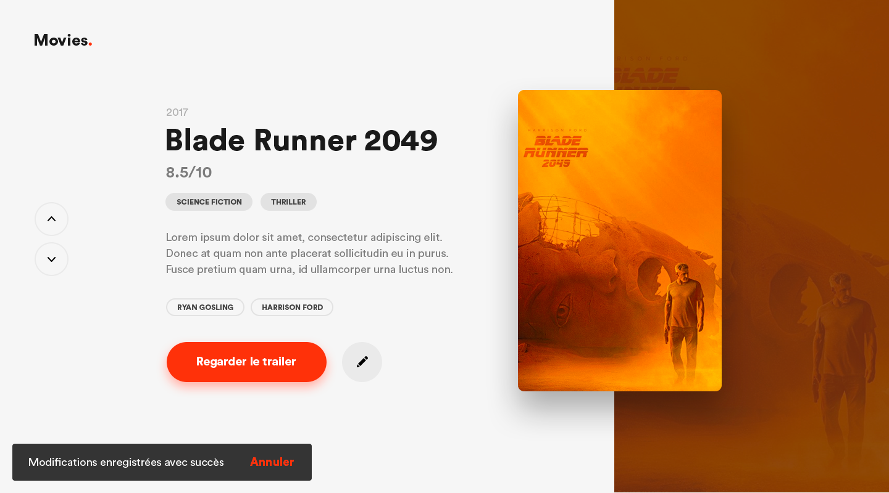
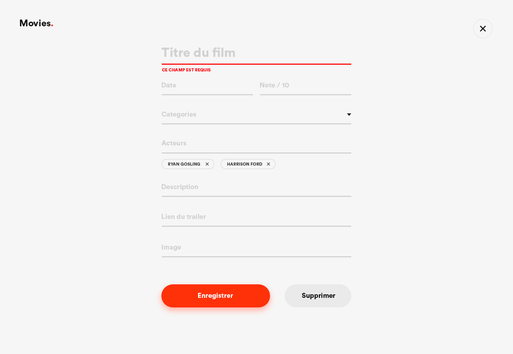

# Projet Movies.

<b>Movies</b> est une application web permettant de rassembler les meilleurs films de ces dernières années.
Elle permet d’ajouter, de voir, de modifier et de supprimer des films ainsi que de filtrer les films par genre.

Des maquettes ont été réalisées avant le début de l’intégration.

### Techno utilisées:
* Meteorjs
* Material-UI

### Aperçu

##### Page d'accueil

##### Affiche du film

##### Ajouter/Modifier un film

### Collaborateurs
* William Nisole (Développeur Front-End): https://github.com/wizai
* Elvinn Tombert (Développeur Front-End): https://github.com/etombert
* Hervé Rabenarisoa (Designer) : www.rbna.fr/
